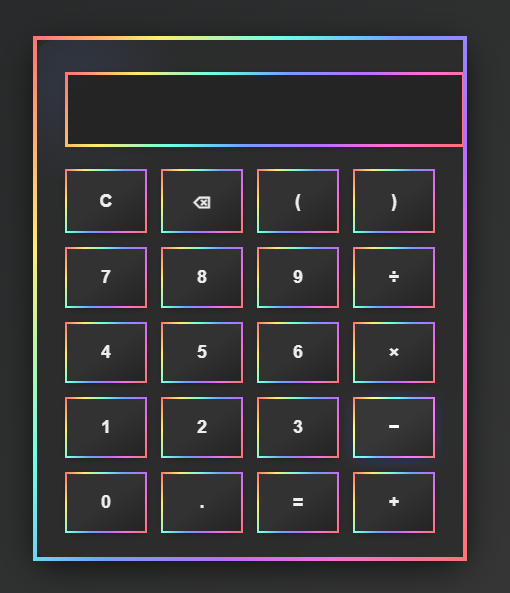

# 🧮 Simple Calculator Web App

A basic calculator built using HTML, CSS, and JavaScript. It supports standard arithmetic operations like addition, subtraction, multiplication, and division.

## 🚀 Features
- Clean and responsive user interface
- Real-time calculation
- Supports:
  - Addition (+)
  - Subtraction (−)
  - Multiplication (×)
  - Division (÷)
  - Clear (C) and Delete (⌫)

## 🛠️ Tech Stack
- HTML5
- CSS3
- JavaScript

## 📸 Screenshot

## 🖥️ Live Demo
👉 [Click here to view the calculator](https://riteshkalkar.github.io/Calculator/)

## 📁 Folder Structure
Calculator/
├── index.html
├── style.css
├── script.js
├── README.md
└── screenshots/
    └── calculator_ui.png

